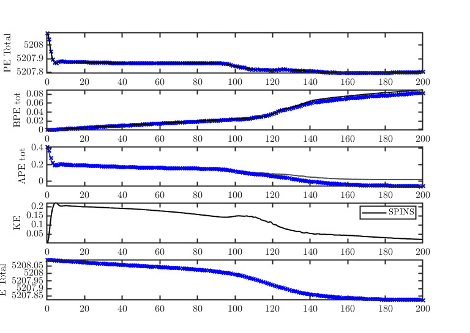
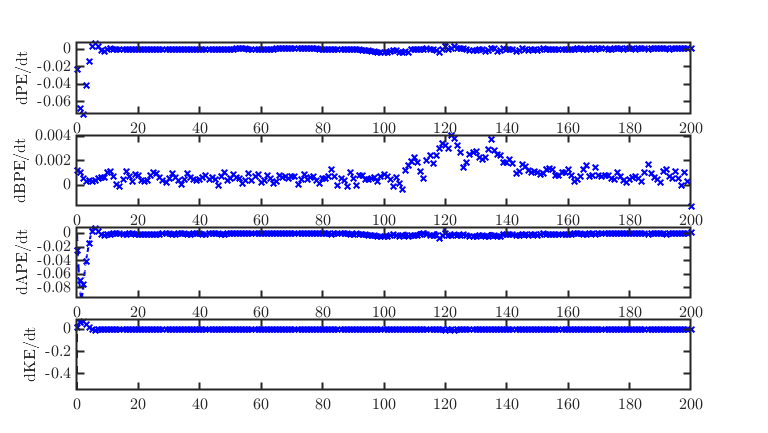
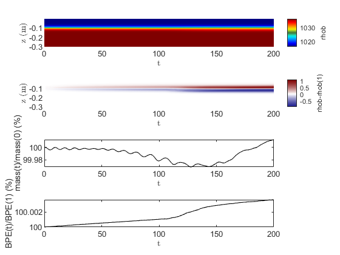

## SPINS_ENERGETICS
This set of scripts is to help the user interrogate and analyse the energetics-related outputs from SPINS. 

There are two toolboxes:
- Offline\_Sorting : a MATLAB implementation of the sorting algorithm \& checks for it's validity
- Analyse\_Diagnos : Analysis of onboard SPINS diagnostics

Author: Sam Hartharn-Evans, 2022

## Analyse Diagnostics - Analysis of onboard SPINS diagnostics:
### Calculate Energetics
[`calc_energetics`](./Analyse_Diagnos/calc_energetics.m) is a re-formulation of SPINSmatlab [plot_diagnos](https://git.uwaterloo.ca/ddeepwel/SPINSmatlab/-/blob/master/plotting/plot_diagnos.m), which works for even very large number of outputs. Unlike, it reduces the temporal frequency consistently onto a regularly spaced grid across all outputs, and implements a different filter onto BPE which works for any size array. The diagnostics are then used to calculate  BPE, PE, KE, APE, etc using the same equations as Deepwell.

### BPE Filters
[`filt_design`](./Analyse_Diagnos/filt_design.m) is to explain the choice of timeseries filter used in calc_energetics BPE filter, compared to the one used in plot_diagnos. Three filters are explored, mlptdenoise, a spectral lowpass filter, and the MATLAB smooth filter (running mean). 

### Mixing Characteristics
[`mixing_characteristics`](./Analyse_Diagnos/mixing_characteristics.m) calculates some characteristics which are
 relevant to mixing:
 - Pycnocline thickness, Nz in pycnocline, Dz in pycnocline, $L_{pyc}/Dx$
 - $ Sc = \nu/\kappa_{\rho}$ : Schmidt number, indicating momentum diffusivity over molecular diffusivity
 - Characterises the SPINS filter (exponential or hyperviscosity), assuming $k_{nyquist} = \frac{\pi}{Lx}(Nx-1)$

## Offline Sorting - a MATLAB implementation of the sorting algorithm \& checks for it's validity
### Sort Energetics
[`sort_energetics.m`](./Offline_Sorting/sort_energetics.m) employs the Winters (1995)-like sorting algorithm for a
mapped case to calculate BPE for a mapped grid (based off sorted stratification across the entire domain, $\rho_b$), calculates PE, and APE & BPE, and then also calculates KE and packages into a structure:
 $$APE = 9.81 \sum_{j=1}^{Nx} \sum_{i=1}^{Nz} W^{i, j} (\rho^{i, j} - \rho_{b}^{i, j})z^{i, j}$$
 $$BPE = 9.81 \sum_{j=1}^{Nx} \sum_{i=1}^{Nz} W^{i, j} \rho_{b}^{i, j}z^{i, j}$$
 $$PE = 9.81 \sum_{j=1}^{Nx} \sum_{i=1}^{Nz} W^{i, j} (\rho^{i, j})z^{i, j}$$

### Run sort energetics
[`run_sort_energetics.m`](./Offline_Sorting/run_sort_energetics.m) calculates and saves the output of sort\_energetics for each timestep.

### Plot offline energetics
[`plot_offline_energetics.m`](./Offline_Sorting/plot_offline_energetics.m) plots timeseries of each energetic component, and can optionally compare these to all_diagnos.mat produced from plot_diagnos.m:

### Check Rho b Hovmoller
[`check_rhob_hovmoller`](./Offline_Sorting/check_rhob_hovmoller.m) plots diagnostics related to the sorting algorithm

- a) Reference density profile ( $\rho_b$ ) hovmoller
- b) Change in reference density profile ( $\rho_b - \rho_b(0)$ ) hovmoller
- c) Mass deviation timeseries
- d) Change in BPE over time

(b) is very useful to indicate if things look correct, we'll see a dipole band appear around the pycnocline, intensifying through the timeseries. (c) indicates if things look very wrong, for example if the mass suddenly ramps up. 
